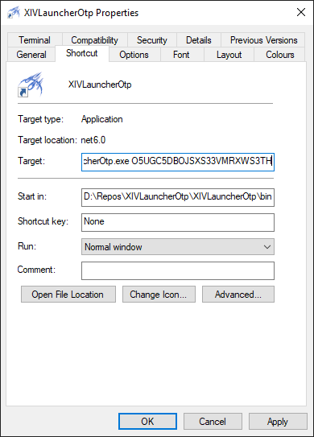

# XIVLauncherOtp

Do you want to get a free teleport but do you not care about security? Then this tool is for you.

## Usage

1. Install XIVLauncher
2. Launch XIVLauncher and set it up correctly
   1. Check "Enable XL Authenticator app/OTP macro support" in the settings.
   2. Login in and check automatically log in.
3. Start this tool with your TOTP secret as its argument `XIVLauncherOtp.exe O5UGC5DBOJSXS33VMRXWS3TH`
4. Profit

Instead of manually starting the tool from the command line you can also create a shortcut and place that in your start. Remember to place the secret after the `..XIVLauncherOtp.exe` part in the target field.

## Where do I get my secret?

I don't know. I extracted mine from my TOTP app. This application expects the secret to be encoded in Base32.

## Why the heck are you storing the secret unencrypted??

If you cared about security then you wouldn't use this. The whole idea of TOTP is that you need a second device to login.
